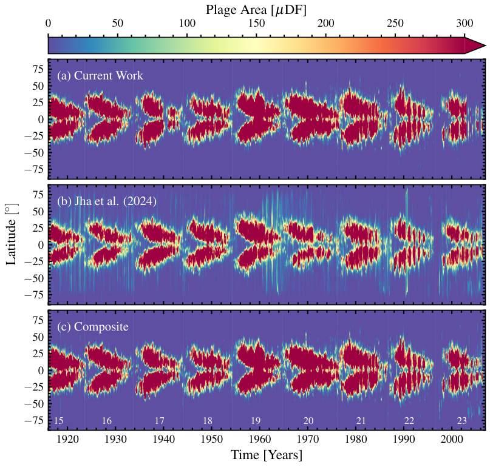

# Machine Learning–based Identification of the Solar Disk and Plages in Kodaikanal Solar Observatory Historical Suncharts

## Abstract

Kodaikanal Solar Observatory (KoSO) is one of the oldest solar observatories, possessing an archive of multiwavelength solar observations, including white light, Ca ii K, and H<em>α</em> images spanning over a century. In addition to these observations, KoSO has preserved hand-drawn suncharts (1904–2022), on which various solar features such as sunspots, plages, filaments, and prominences are marked on the Stonyhurst grid with distinct color coding. In this study, we present the first comprehensive result that includes the entire dataset from these suncharts using a supervised machine learning (ML) model called “convolutional neural networks” (CNNs), first to identify the solar disks from the charts (1909–2007) and second to identify the plages, spanning nine solar cycles (1916–2007). We train the CNN with the manually identified solar disk and plages. We first detect the solar limb and the north–south line in the suncharts, which enables the extraction of disk center coordinates, radius, and <em>P</em> angle. Following that, we use a CNN similar architecture to achieve accurate image segmentation for the identification of plages. We compare plage areas derived from the suncharts with those obtained from Ca ii K full-disk observations, and find good agreement that demonstrates the potential application of such an ML technique for historical data. The results of this study further demonstrate the potential application of sunchart data to fill the existing data gaps in the KoSO multiwavelength observations and contribute toward constructing a composite series over the last century.

## Data and code

| File | Description |
| :--- | :--- |
| [`KoSO_sunchart_plage_butterfly.h5`](apjs_material/KoSO_sunchart_plage_butterfly.h5) | Daily plage-area time–latitude data for 1916–2007. |
| [`filtered_sunchart_mask_area.txt`](apjs_material/filtered_sunchart_mask_area.txt) | Filtered sunchart plage-area data. |
| [`code_ApjS.py`](apjs_material/code_ApjS.py) | Python code supplied with the ApJS material. |
| [`readme.md`](apjs_material/readme.md) | Detailed description of the ApJS dataset and its HDF5 structure. |

## Plage-area butterfly diagram

